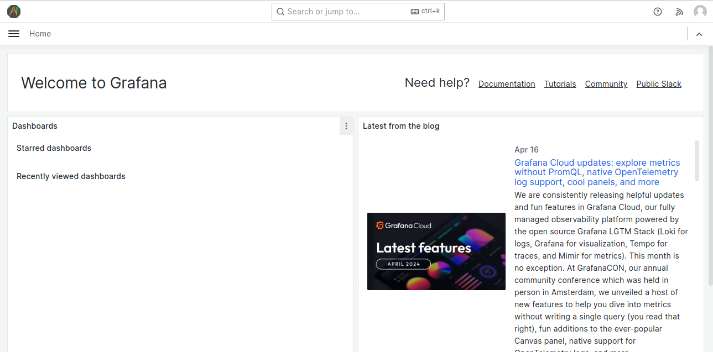

This document covers about how to access and register the control plane cluster in Capten UI.

# CAPTEN UI

### How to Access the UI?

1. For a new user, register in the Intelops  UI to create a new account by signing up .

2. For an already registered user,just login with user credentials


3. After registering as a new user, popup screen will be displayed for creating organisation. Create organisation and assign the specific role.

Note:

For registering the cluster in UI,cluster admin role is needed.

### Registering Controlplane cluster


1. Provide the cluster name and upload the certificates created when apps are deployed.

2. Follow this format for providing cluster agent endpoint

```bash
https://captenagent.<domainname>
```

For eg,if specific domain nam is provided ,consider as 'aws.eg.com',then cluster agent endpoint will be

```bash
https://captenagent.aws.eg.com
```

3. After providing above details, register the cluster.


### Capten Cluster Applications Management

Capten have launched UI for applications like grafana,signoz,argocd and tekton.


So once after logging in grafana via SSO,certain dashoards will be displayed




With the help of dashboards,following operations could be performed
- monitoring tha applications using logs
- monitoring and collecting the metrics of each applications in the cluster like node usage,cpu usage,memory usage,cluster health, resource utilizations etc.

One of the cluster-overview metrics dashboards is shown below


\*\*Note:
separate dashboards are present for each application for monitoring purpose


### DeRegistering the Controlplane cluster

Click the remove button to deregister the controlPlane cluster.
